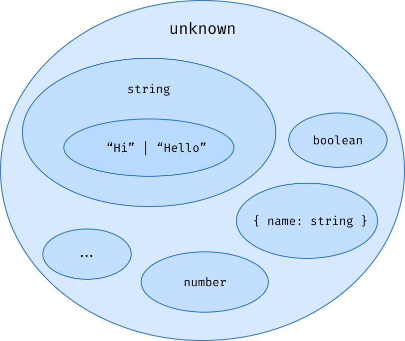

## O que são Literal Types?
Um **Literal Type** permite que uma variável tenha apenas um valor específico, em vez de um tipo mais genérico.

### Exemplo:
```ts
const nome = 'Alisson'; 
// O tipo será 'Alisson' (literal), pois é uma constante e não pode ser alterado.

let nome2 = 'Alisson'; 
// O tipo será string, pois pode ser alterado para qualquer outra string.
```

### Exemplo com erro:
```ts
const nome: 'Ana' = 'ana'; 
// Erro! O TypeScript espera 'Ana', mas recebeu 'ana' (case-sensitive).
```

### Literal Types com Booleanos
Podemos definir variáveis com tipos literais de true ou false:

```ts
const sempreTrue: true = true;
const sempreFalse: false = false;
```
**`Isso significa que sempreTrue nunca poderá ser false, e sempreFalse nunca poderá ser true`**.

### Literal Types em Arrays
Os arrays não são considerados tipos primitivos, então mesmo quando declarados como **const**, o TypeScript não infere os valores literais, mas sim um array do tipo base:

```ts
const arr = [1, 2, 3]; 
// Tipo inferido: number[]
// Não é inferido como 1 | 2 | 3 porque arrays não são imutáveis como um número ou string.
```
#### Se quisermos um array com valores literais, precisamos definir como uma tupla:

```ts
const arrLiteral: [1, 2, 3] = [1, 2, 3]; 
// Agora o tipo é exatamente [1, 2, 3], sem permitir alteração nos valores.
```

### Hierarquia de Tipos no TypeScript
O TypeScript utiliza um modelo baseado em conjuntos para determinar quais tipos podem ser atribuídos a outros.

### Exemplo de Hierarquia
```ts
const name: string = 'Hello'; 
// 'Alisson' pertence ao conjunto do tipo string.
```
`O valor 'Hello' está contido dentro do conjunto string, ou seja, um tipo literal ('Hello') é um subconjunto de string.`



### O Maior Tipo: `unknown`
O unknown é o tipo mais abrangente do TypeScript, pois qualquer tipo pode ser atribuído a ele.

```ts
let valorDesconhecido: unknown;
valorDesconhecido = 10; // ✅ Pode receber um número
valorDesconhecido = "Texto"; // ✅ Pode receber uma string
valorDesconhecido = true; // ✅ Pode receber um booleano
```

`Mas cuidado! O unknown não pode ser atribuído diretamente a outro tipo sem verificação`

```ts
let valor: string = valorDesconhecido; // ❌ Erro! 
```
`Para utilizá-lo, precisamos fazer um type check`

```ts
if (typeof valorDesconhecido === 'string') {
  let valor: string = valorDesconhecido; // ✅ Agora funciona!
}
```

### O Tipo `never`: O Oposto de unknown
- O never representa um conjunto vazio.
- Nenhum valor pode ser associado a ele, mas ele pode ser atribuído a qualquer outro tipo.

### Exemplo com never
```ts
function erro(): never {
  throw new Error("Erro crítico!");
}
//A função acima nunca retorna um valor, pois lança um erro.
```

`O tipo never é usado quando algo nunca acontece no código`

### Diferença entre unknown e never
|  Tipo |Pode receber qualquer valor?|Pode ser atribuído a qualquer tipo?|
|-------|----------------------------|-----------------------------------|
|unknown|             Sim            |   Não (precisa de verificação)    |
| never |	          Não	         |       Sim(porque é vazio)         |

